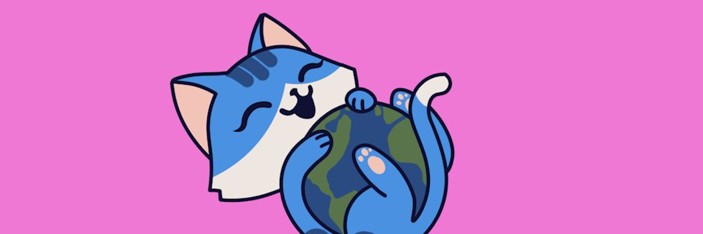

# Nyanicons Python

The Python implementation of the Nyanicons avatar generation library for the Nyano cryptocurrency

[ nyano.org](https://nyano.org)
&nbsp;&nbsp;&nbsp;&nbsp;[ r/Nyano](https://reddit.com/r/nyano/)
&nbsp;&nbsp;&nbsp;&nbsp;[ Discord](https://discord.gg/bAeGuKpKtA)
&nbsp;&nbsp;&nbsp;&nbsp;[ Twitter](https://twitter.com/Nyanocrypto) &nbsp;+&nbsp; [#Nyano](https://twitter.com/search?q=%23Nyano)

| ⚠️ HELP NEEDED We need help from developers and SVG artists! Please see [How can you help?](#how-can-you-help) for details. |
|:----------------------------------------------------------------------------------------------------------------------------------|

## What is Nyano?

For information about Nyano, please see the [Nyano README](README_NYANO)
  
## What are Nyanicons?

Similar to Natricons in Nano's Natrium wallet, and MonKeys in the Kalium wallet (for Nano's sister-project Banano), 
Nyanicons aim to provide a fun artistic touch to Nyano addresses to be displayed in wallaet apps or anywhere the address
is shown. Every Nyano address is hashed into a corresponding set of avatar components, which are layered to create a 
composite avatar image, called a Nyanicon. 

## How does this work?

The high-level steps taken to generate a Nyanicon avatar given a Nano address are:
1. Extract the public key from the Nano address
2. Split the public key into N+1 parts, where N is the number of avatar component directories (eg head, collar, eyes, mouth, hat, accessory)
   * The +1 is to add a part to determine the avatar's primary color, used to generate the avatar's color scheme
3. Generate the avatar's color scheme
   * **PRIMARY_COLOR**: the color determined by the part of the address dedicated as the primary color
   * **SECONDARY_COLOR**: one of two triadic complimentary colors to PRIMARY_COLOR
   * **TERTIARY_COLOR**: the other of two triadic complimentary colors to PRIMARY_COLOR
   * **MONOCHROME_COLOR**: a lighter or darker modification of PRIMARY_COLOR, to be used as an accent
   * **GRAYSCALE_COLOR**: the desaturation of PRIMARY_COLOR, to be used as a neutral color accent
4. Cipher (hash) each part value into an index for a single SVG asset file within the corresponding avatar component directory 
5. Colorize each SVG asset using the generated color scheme
6. Layer the colorized SVG assets together into a single composite avatar image 

## Nyanicons ~~could~~ will definitely change with future releases

Please understand that while we work to stabilize the Nyanicons library, it will be undergoing rapid changes, including 
the addition of new SVG assets and changes to the algorithm that generate the composite avatar given a particular Nano 
address. Therefore, it is extremely likely that the Nyanicon that you see assigned to your particular Nano address will 
change with a future release. After a stable v1 is released, it will become less likely that avatars will change.

## How can you help?

### Developers

Join the [#devs-general](https://discord.com/channels/903341738054258748/903478614757089310) channel in the Discord
server to chat!

Upon releasing Nyanicons v1, we'll soon be looking for help porting the Nyanicons library to other languages, 
including Dart, Kotlin, Swift, Javascript, and more. Any help with these ports would be absolutely welcome. We'll link
the repositories for the ports as they are created.

### SVG Artists

#### Creating Nyanicon avatar assets

Join the [#art-general](https://discord.com/channels/903341738054258748/903478579646595083) channel in the Discord
server to chat!

TODO
